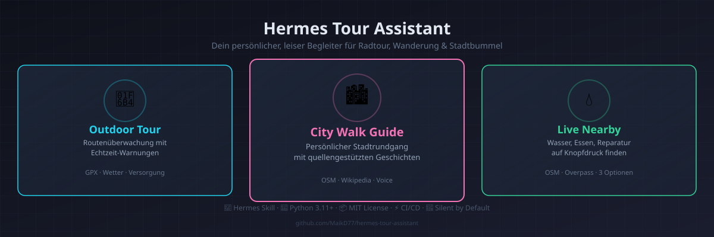
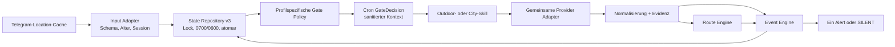

# Hermes Tour Assistant 🚴🚶

<p align="center">
  
</p>

**Bau dir deinen persönlichen Tour-Begleiter für Hermes Agent.** Egal ob Radtour, Wanderung oder Stadtbummel — der Assistent überwacht deine Live-Standort, warnt vor Routenabweichungen, findet Wasser- und Versorgungspunkte, checkt das Wetter und erzählt dir an Stationen spannende Geschichten. Und das alles leise: Nur wenn wirklich was los ist, meldet er sich.

- 🚴 **Outdoor Tour Assistant** — GPX-Routenüberwachung mit Echtzeit-Warnungen
- 🏙️ **City Walk Guide** — persönlicher, quellengestützter Stadtrundgang per Telegram
- 💧 **Live Location Nearby** — findet Wasser, Essen, Reparatur, Unterkunft
- 🤫 **Silent by default** — kein Rauschen, nur Signale

Private, standortbewusste Outdoor- und Stadtführungs-Skills für
[Hermes Agent](https://hermes-agent.nousresearch.com). Der Outdoor-Assistent
überwacht GPX-Touren leise und ereignisbasiert. Der City Walk Guide plant einen
persönlichen, belegten Stadtrundgang und erzählt an erreichten Stationen per Text
und optionaler Telegram-Voice-Bubble.

> **Schweigen ist der Normalfall.** Ohne ausgewähltes Ereignis antwortet der
> Cron-Agent ausschließlich mit `[SILENT]`.

## Stand: Version 1.4.1

**Neu in 1.4.1 — Weather Hunter 🌤️ & Mobile-Optimierung 📱 & TTS-Sprachausgabe 🎧**
- Stündliche Niederschlagsvorhersage via Open-Meteo
- Berechnet ob du dem Regen davonfahren kannst ("Noch 15 min bis Regen — bei 28 km/h schaffst du's!")
- Neue Event-Priorität `weather_hunter` im Event-Engine-Cooldown-System
- CLI-Kommando `tourctl.py weather-forecast --hours 3`
- **Mobile-optimierte Alerts** für iPhone Lock Screen:
  - Emoji-Marker als visuelle Kategorie (🌧️⚠️🚴🏘️🍽️📍✅)
  - Aktion + Distanz fett in Zeile 1 = Lock-Screen-Preview
  - Maximal 3 Zeilen pro Alert
  - Beispiel: `🌧️ **Regen in 12 min** – 8 km voraus`
- **TTS-Sprachausgabe** (ElevenLabs / George):
  - POI-Ansagen werden als Telegram-Voice-Bubble ausgeliefert
  - Wikipedia-Inhalte vom LLM auf 30–60 Sekunden gekürzt
  - Aktiviert per `[[audio_as_voice]]`-Tag für native Voice-Bubble

**Version 1.4** ergänzt den fachlich getrennten `city-walk-guide` und zieht
gemeinsame Standort-, State-, Routing-, Provider- und Ausgabeprimitive in
`location-session-core`. Der Outdoor-State v3 und seine Migration bleiben
kompatibel.

Der Outdoor-Assistent verwendet weiterhin einen einzigen produktiven Datenfluss:

- ein selbst enthaltenes, installierbares Skill-Paket;
- Session-State v3 mit Migration aus v1 und v2;
- prozessübergreifende Sperre, atomare Writes und private Dateirechte;
- segmentbasiertes GPX-Matching einschließlich Ambiguitätserkennung;
- ein Gate ohne präzise Koordinaten im Cron-stdout;
- priorisierte Events mit Evidenzpflicht, Confidence und Cooldown;
- normalisierte Providerfehler, Backoff, Circuit Breaker und TTL-Cache;
- strukturierte aktuelle Wetterdaten über Open-Meteo;
- strukturierte Karten-, Siedlungs-, Versorgungs- und Wassersuche über
  OpenStreetMap/Nominatim/Overpass;
- ein abgesicherter lokaler GPX-Adapter für exportierte Komoot- oder
  Drittanbieter-Routen;
- sichere Markdown-Labels und ausschließlich lokal erzeugte Navigationslinks;
- Diagnose-, Retention- und Agent-Kommandos über `tourctl.py`.

Der City Walk Guide bietet zusätzlich:

- einen validierten `GuideRequest` für 30–240 Minuten;
- standardmäßig einen 90-minütigen Rundgang mit lokalem Leben, Genuss,
  Geschichte und Architektur;
- OSM-Kandidaten sowie deutsche Wikipedia- und Wikidata-Inhalte mit markiertem
  Englisch-Fallback;
- eine OpenRouteService-Fußroute innerhalb von ±15 Prozent des Zeitbudgets;
- privat vorab geladene, quellengestützte Geschichten;
- Stopauslösung bis 80 Meter und Neuplanung nach zwei Abweichungen ab 120 Meter;
- validierte Betriebs- und Dialogkommandos über `cityctl.py`.

Die Anwendung ist ein Informations- und Entwicklungswerkzeug, kein
zertifiziertes Navigations- oder Warnsystem.

## Architektur



Das LLM editiert den technischen State nicht. Route, Siedlungen, Providerdaten
und Ereignisse werden ausschließlich über die validierten Runtime-Kommandos
geschrieben.

## Benachrichtigungspolitik

Die Event Engine priorisiert:

1. akute Sicherheit;
2. deutliche Routenabweichung;
3. Wetterwarnung;
4. kritische Versorgungslücke;
5. verifizierte Ortsannäherung;
6. Komfort-POI.

Pro Wake wird höchstens ein normales Ereignis geliefert. Bis zu drei Meldungen
sind nur zulässig, wenn alle sicherheitskritisch sind. Externe Ereignisse ohne
Evidenz oder mit Confidence unter `0.5` bleiben stumm.

Neutrale Punkte entlang einer Route heißen `route_checkpoint`. Sie sind keine
Siedlungen und lösen keinen `town_approach` aus.

## Repository-Struktur

```text
hermes-tour-assistant/
├── README.md
├── INSTALLATION.md
├── SECURITY.md
├── pyproject.toml
├── skills/
│   ├── outdoor-tour-assistant/
│   │   ├── SKILL.md
│   │   ├── scripts/
│   │   │   ├── contracts.py
│   │   │   ├── live_tour_gate.py
│   │   │   ├── tour_state.py
│   │   │   ├── route_engine.py
│   │   │   ├── event_engine.py
│   │   │   ├── providers.py
│   │   │   ├── tour_runtime.py
│   │   │   ├── tourctl.py
│   │   │   └── prepare_tour.py
│   │   └── references/
│   ├── city-walk-guide/
│   │   ├── SKILL.md
│   │   ├── scripts/
│   │   │   ├── city_contracts.py
│   │   │   ├── city_planner.py
│   │   │   ├── city_runtime.py
│   │   │   ├── city_state.py
│   │   │   ├── cityctl.py
│   │   │   └── live_city_gate.py
│   │   └── references/
│   ├── location-session-core/
│   │   ├── SKILL.md
│   │   └── scripts/location_core/
│   └── live-location-nearby/
│       ├── SKILL.md
│       └── scripts/find_water.py
└── tests/
```

Jeder nutzerseitige Skill besitzt genau einen kanonischen Ordner. Der interne
`location-session-core` enthält die gemeinsam genutzte Implementierung; schmale
Outdoor-Kompatibilitätsmodule erhalten bestehende Installationen und Imports.

## Schnellstart

```bash
git clone https://github.com/MaikD77/hermes-tour-assistant.git
cd hermes-tour-assistant
cp -R skills/outdoor-tour-assistant ~/.hermes/skills/
cp -R skills/live-location-nearby ~/.hermes/skills/
cp -R skills/location-session-core ~/.hermes/skills/
cp -R skills/city-walk-guide ~/.hermes/skills/
```

## Beispiele — was du damit machen kannst

| Skill | Beispiel-Prompt | Ergebnis |
|-------|----------------|----------|
| 🚴 Outdoor | „Ich starte meine Spessart-Tour, überwache mich." | Routen-Matching, Live-Tracking, Wetter + Warnungen |
| 🏙️ City Walk | „Gib mir einen 90-minütigen Stadtrundgang durch Erfurt." | Quellengestützter Rundgang mit Geschichten pro Station |
| 💧 Nearby | „Wo gibt's hier Trinkwasser?" | Nächste Brunnen/Tanks/Raststätten via OSM |
| 🛑 Sicherheit | „Bin ich noch auf der Route?" | Routenabweichung + Off-Route-Alarm |

Die Hermes-Service-Umgebung benötigt mindestens:

```bash
export HERMES_TOUR_CHAT_ID="DEINE_TELEGRAM_CHAT_ID"
export HERMES_TOUR_ACTIVITY="cycling"  # oder walking
export HERMES_TOUR_LOCALE="de-DE"
# optional: Verzeichnis mit vorab exportierten GPX-Routen
export HERMES_TOUR_ROUTE_DIR="/privater/pfad/zu/routen"
# für den City Walk Guide
export HERMES_CITY_GUIDE_CHAT_ID="DEINE_TELEGRAM_CHAT_ID"
export OPENROUTESERVICE_API_KEY="DEIN_ORS_SCHLUESSEL"
```

Das Gate muss jede Minute gestartet werden:

```text
~/.hermes/skills/outdoor-tour-assistant/scripts/live_tour_gate.py
```

Der vollständige Cronjob, Betriebsbefehle und Rollout stehen in
[INSTALLATION.md](INSTALLATION.md).

## State v3

Der private State liegt standardmäßig unter
`~/.hermes/state/live_tour_assistant.json` und enthält:

- `session` – pseudonyme Share-ID und Lebenszyklus;
- `route` – Matchstatus, Provider, privater GPX-Pfad und verifizierte Orte;
- `position` – interne Position und deterministischer Routenmatch;
- `schedule` – Cadence, Wake-Zeitpunkte, Hysterese und Cooldowns;
- `events`, `weather` und `provider_health`.

Alte v1-/v2-Zustände werden beim ersten Zugriff validiert nach v3 migriert.
Beschädigte Dateien werden privat unter
`live_tour_assistant.json.corrupt-*` quarantänisiert.

## Entwicklung

```bash
python3 -m pip install -e ".[test]"
ruff check skills tests
mypy skills/location-session-core/scripts skills/outdoor-tour-assistant/scripts skills/city-walk-guide/scripts
pytest --cov --cov-fail-under=85
python3 -m build
```

Die Tests verwenden keine echten Standort- oder Providerdaten. Realer Rollout
erfolgt über Replay, Shadow Mode und Canary Delivery.

## Datenschutz

Präzise Standorte bleiben aus Gate-Ausgabe und Diagnoseberichten heraus. City
Walks verwenden den separaten privaten State
`~/.hermes/state/city_guide_state.json` und werden nach Abschluss standardmäßig
nach 24 Stunden bereinigt. Ein
expliziter Provideraufruf kann die aktuelle oder vorausliegende Position an den
konfigurierten Anbieter übertragen und erscheint gegebenenfalls im
Hermes-Tool-Audit. Details und Grenzen stehen in [SECURITY.md](SECURITY.md).

---

> **GitHub Topics (empfohlen):** `hermes-agent`, `hermes-skill`, `outdoor`, `cycling`, `city-walk`, `gpx`, `telegram-bot`, `live-location`, `openstreetmap`, `osm`

## Community & Austausch

| Plattform | Wo posten? | Warum? |
|-----------|-----------|--------|
| 🎮 **Nous Discord** | [#agent](https://discord.gg/nousresearch) | 128k+ Mitglieder, aktivste Community |
| 📱 **Reddit** | [r/hermesagent](https://reddit.com/r/hermesagent) | Offizielles Sub, Nous-Team aktiv |
| 💬 **GitHub Discussions** | [Hermes Agent](https://github.com/nousresearch/hermes-agent/discussions) | Skills teilen & diskutieren |
| 📖 **Skills Hub** | [Hermes Docs](https://hermes-agent.nousresearch.com/docs) | Community-Skills-Katalog |
| 🐛 **Issues** | [Hier](https://github.com/MaikD77/hermes-tour-assistant/issues) | Bug-Reports & Feature-Wünsche
