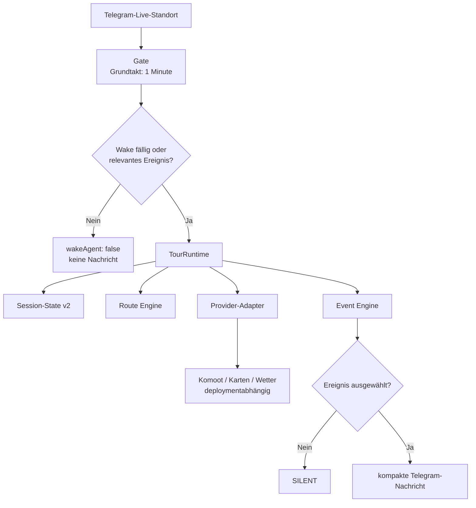

# Hermes Tour Assistant 🚴

[](https://github.com/MaikD77/hermes-tour-assistant/actions/workflows/test.yml)

Ein leiser, routenbewusster Tour-Assistent für die
[Hermes-Agent-Plattform](https://hermes-agent.nousresearch.com). Er verarbeitet
Telegram-Live-Standorte, ordnet Positionen einer GPX-Route zu und priorisiert
handlungsrelevante Ereignisse, ohne den Chat mit regelmäßigen Statusmeldungen zu
füllen.

> **Schweigen ist der Normalfall.** Nur ein neues, relevantes und ausreichend
> belastbares Ereignis soll eine Benachrichtigung auslösen.

## Projektstatus

Der Stand nach den gemergten PRs #1 bis #7 ist ein **stabilisierter und
getesteter Kern für Version 1.2**:

- Test- und CI-Grundlage für Python 3.11, 3.12 und 3.13
- dynamisches Gate-Scheduling mit expliziter Fälligkeit
- versionierter Session-State v2
- deterministische, segmentbasierte Route Engine
- persistierbare Event Engine mit Prioritäten und Cooldowns
- Provider-Verträge mit Retry, Backoff, Cache und Health-State
- gemeinsame Runtime für State, Route und Ereignisse
- Diagnose-, Rechte- und Retention-Werkzeug
- installierbare Hermes-Skill-Verzeichnisse und dokumentierte Trust Boundary

Der Kern ist damit wesentlich belastbarer als die ursprüngliche Version 1.1,
aber die konkrete Einbindung von Komoot, Karten- und Wetterdiensten bleibt vom
jeweiligen Hermes-Deployment abhängig. Das Projekt ist ein Informations- und
Entwicklungswerkzeug, kein zertifiziertes Navigations- oder Warnsystem.

## Was bereits implementiert ist

| Bereich | Aktueller Stand |
|---|---|
| **Test und CI** | `pytest` und `ruff`; GitHub-Actions-Matrix für Python 3.11–3.13 |
| **Gate-Scheduling** | Cron-Grundtakt von einer Minute; intern 2, 3, 5 oder 15 Minuten; Erhalt des letzten Wake-Zustands; `next_due_at`; Bewegungs- und Ereignis-Trigger |
| **Off-Route-Logik** | Hysterese mit Eintritt über 150 m und Auflösung unter 80 m; Cooldown gegen Wiederholungen |
| **Session-State v2** | eindeutige Session pro Live-Share, validierte Zustände, Route-Reset beim Sessionwechsel, atomare Schreibvorgänge mit Dateimodus `0600` |
| **Route Engine** | XML-basiertes GPX-Parsing, Track- und Routenpunkte, Projektion auf Routensegmente, Fortschritt, Restdistanz, Richtung und Confidence |
| **Event Engine** | persistente Ereignisse, Priorisierung, Confidence-Schwelle, Cooldown, Auflösung und höchstens ein normales Ereignis je Wake |
| **Provider-Kern** | Verträge für Route, Karte und Wetter; Retry mit exponentiellem Backoff, TTL-Cache und Provider-Health |
| **Routenkorridor** | Suchpunkte 3, 6 und 10 km voraus; Filterung von Ergebnissen hinter der Fahrtrichtung oder zu weit abseits der Route |
| **Runtime** | `TourRuntime` verbindet Session-State, Route Matching, Positionsfortschritt und Event-Auswahl |
| **Betrieb** | `tourctl.py` für Diagnose, private Dateirechte und Löschung abgelaufener GPX-, Temp- und Backup-Dateien |
| **Sicherheit** | externe Texte gelten als nicht vertrauenswürdige Daten; keine Ausführung von Anweisungen aus POI-, Karten-, Routen- oder Provider-Inhalten |

## Architektur



### Verantwortlichkeiten

- **Gate:** entscheidet deterministisch, ob ein Agent-Lauf fällig ist.
- **Session-State:** trennt Live-Shares voneinander und verhindert die
  Wiederverwendung einer alten Route.
- **Route Engine:** berechnet Routenoffset, Fortschritt, Restdistanz und
  Richtung aus GPX-Geometrie.
- **Event Engine:** priorisiert, dedupliziert und begrenzt Benachrichtigungen.
- **Provider-Adapter:** kapseln externe Routen-, Karten- und Wetterquellen.
- **LLM/Skill:** bewertet unstrukturierte Evidenz und formuliert die kurze
  Nutzernachricht; es besitzt nicht den technischen Tour-State.

## Benachrichtigungspolitik

Die Event Engine verwendet folgende Standardreihenfolge:

1. akute Sicherheit
2. deutliche Routenabweichung
3. Wetterwarnung
4. kritische Versorgungslücke
5. bestätigte Ortsannäherung
6. Komfort-POI

Normalerweise wird pro Wake höchstens ein Ereignis ausgeliefert. Nur bei
gleichzeitig sicherheitskritischen Ereignissen sind bis zu drei Hinweise
zulässig. Ereignisse unterhalb der Confidence-Schwelle von `0.5` werden nicht
ausgeliefert.

Neutrale Punkte im Abstand von etwa fünf Kilometern heißen
`route_checkpoint`. Sie sind ausdrücklich **keine erkannten Orte**. Ein
Ortsereignis darf nur aus einem bestätigten `place`-Objekt entstehen.

## Repository-Struktur

```text
hermes-tour-assistant/
├── README.md
├── INSTALLATION.md
├── SECURITY.md
├── LICENSE
├── pyproject.toml
├── .github/
│   └── workflows/
│       └── test.yml
├── scripts/
│   ├── live_tour_gate.py
│   ├── tour_state.py
│   ├── route_engine.py
│   ├── event_engine.py
│   ├── providers.py
│   ├── tour_runtime.py
│   ├── tourctl.py
│   └── prepare_tour.py
├── skills/
│   ├── outdoor-tour-assistant/
│   │   └── SKILL.md
│   └── live-location-nearby/
│       ├── SKILL.md
│       └── scripts/
│           └── find_water.py
├── references/
└── tests/
```

Für Neuinstallationen ist
`skills/outdoor-tour-assistant/SKILL.md` die maßgebliche Skill-Datei. Die
Root-Datei `SKILL.md`, `cron-prompt-generic.md` und `prepare_tour.py` bleiben
vorerst als Kompatibilitätsartefakte der ursprünglichen Version erhalten.

## Voraussetzungen

- Hermes Agent unter Linux oder macOS
- Telegram-Adapter mit Cache für bearbeitete Live-Standorte
- Python 3.11 oder neuer
- Hermes-Toolsets `terminal` und `web`
- optional: deploymentfähige Komoot- und Kartenintegration
- optional: strukturierter Wetterprovider

Konkrete Komoot-, Karten- oder Wetterzugänge, Zugangsdaten und Toolnamen sind
nicht Bestandteil des Repositorys. Sie müssen im jeweiligen Hermes-Deployment
an die Verträge in `scripts/providers.py` angebunden werden.

## Installation

### 1. Repository laden

```bash
git clone https://github.com/MaikD77/hermes-tour-assistant.git
cd hermes-tour-assistant
```

### 2. Skills installieren

```bash
cp -R skills/outdoor-tour-assistant ~/.hermes/skills/
cp -R skills/live-location-nearby ~/.hermes/skills/
```

### 3. Runtime-Skripte privat installieren

```bash
install -d -m 700 ~/.hermes/scripts/tour-assistant
install -m 700 scripts/*.py ~/.hermes/scripts/tour-assistant/
install -d -m 700 ~/.hermes/state
```

### 4. Telegram-Chat-ID konfigurieren

```bash
export HERMES_TOUR_CHAT_ID="DEINE_TELEGRAM_CHAT_ID"
```

Die ID gehört in die Service-Umgebung von Hermes. Identifikatoren,
Zugangsdaten und Tokens dürfen nicht fest in Repository-Dateien eingetragen
werden.

### 5. Cronjob einrichten

Das Gate muss jede Minute laufen. Nur so kann es intern eine effektive
2-, 3-, 5- oder 15-Minuten-Kadenz abbilden.

```yaml
job_id: tour-assistant
name: Live Tour Assistant
schedule: every 1m
script: /home/USER/.hermes/scripts/tour-assistant/live_tour_gate.py
workdir: /home/USER
skills:
  - outdoor-tour-assistant
  - live-location-nearby
  - maps
  - komoot
deliver: origin
```

Ein Cron-Grundtakt von fünf Minuten kann die dokumentierte Zwei- oder
Drei-Minuten-Kadenz nicht bereitstellen.

### 6. Rechte härten und Installation prüfen

```bash
python3 ~/.hermes/scripts/tour-assistant/tourctl.py harden-permissions
python3 ~/.hermes/scripts/tour-assistant/tourctl.py diagnose
```

Weitere Betriebsdetails stehen in
[INSTALLATION.md](INSTALLATION.md).

## Dynamische Wake-Kadenz

| Situation | Effektive Kadenz |
|---|---:|
| weniger als 5 km bis zum Ziel | 2 Minuten |
| Geschwindigkeit über 20 km/h | 3 Minuten |
| Geschwindigkeit von 5 bis 20 km/h | 5 Minuten |
| Geschwindigkeit unter 5 km/h | 15 Minuten |

Unabhängig vom Zeittakt können eine neue Live-Freigabe, eine Bewegung von
mindestens 350 m oder ein relevantes Ereignis einen Wake auslösen. Die maximale
reguläre Stille des Gates beträgt 15 Minuten.

## Session-State v2

Der zentrale State liegt standardmäßig unter:

```text
~/.hermes/state/live_tour_assistant.json
```

Vereinfachtes Schema:

```json
{
  "schema_version": 2,
  "session": {
    "id": "telegram-share-id",
    "status": "active",
    "started_at": 0,
    "expires_at": 0,
    "ended_at": null
  },
  "route": {
    "match_status": "matched",
    "provider": "komoot",
    "id": "123",
    "name": "Beispieltour",
    "gpx_path": "/home/USER/.hermes/state/current-tour-123.gpx",
    "verified": true
  },
  "position": {
    "segment_index": 42,
    "offset_m": 18.5,
    "progress_m": 28740.0,
    "remaining_m": 56320.0,
    "direction": "forward",
    "confidence": 0.926
  },
  "events": {},
  "weather": null,
  "provider_health": {}
}
```

Gültige Session-Zustände:

```text
inactive · starting · matching_route · active · ending
```

Gültige Route-Match-Zustände:

```text
unknown · matching · matched · ambiguous · unmatched · failed
```

Nur `matched` darf `verified: true` besitzen. Eine neue Share-ID erzeugt eine
neue Session und setzt Route, Position, Ereignisse und Wetterdaten der
vorherigen Tour zurück. JSON-State wird atomar geschrieben und auf Dateimodus
`0600` gesetzt.

## Diagnose und Betrieb

### Zustandsdateien prüfen

```bash
python3 ~/.hermes/scripts/tour-assistant/tourctl.py diagnose
```

Die Diagnose prüft:

- Existenz der Assistant-, Gate- und Live-Location-Dateien
- gültiges JSON-Objekt
- private Dateirechte

Präzise Koordinaten werden nicht ausgegeben.

Ein abweichendes State-Verzeichnis kann vor dem Unterbefehl angegeben werden:

```bash
python3 ~/.hermes/scripts/tour-assistant/tourctl.py \
  --state-dir /PFAD/ZUM/STATE diagnose
```

### Dateirechte korrigieren

```bash
python3 ~/.hermes/scripts/tour-assistant/tourctl.py harden-permissions
```

Dabei erhält das State-Verzeichnis den Modus `0700`; enthaltene Dateien werden
auf `0600` gesetzt.

### Alte Laufzeitdateien löschen

```bash
python3 ~/.hermes/scripts/tour-assistant/tourctl.py \
  cleanup --older-than-hours 48
```

Die Bereinigung löscht ausschließlich ältere Dateien mit diesen Mustern:

```text
current-tour-*.gpx · *.tmp · *.bak
```

Die aktiven JSON-State-Dateien werden nicht durch diesen Befehl gelöscht. Für
einen regelmäßigen Betrieb sollte die Bereinigung über einen eigenen geplanten
Job ausgeführt werden.

## Provider und Ausfallverhalten

`scripts/providers.py` definiert Verträge für:

- `RouteProvider`
- `MapProvider`
- `WeatherProvider`

Der gemeinsame `ProviderRunner` führt begrenzte Wiederholungsversuche mit
exponentiellem Backoff aus und pflegt einen Health-State mit letztem Erfolg,
letztem Fehler und Anzahl aufeinanderfolgender Fehler. Ein TTL-Cache kann
wiederholte identische Abfragen vermeiden.

Vorgesehenes Degradationsverhalten:

| Ausfall | Verhalten |
|---|---|
| keine verifizierte Route | nur standortbezogene Hilfe; keine Aussagen über Routenfortschritt |
| ungültige GPX-Datei | Route auf `failed`; kein erfundener Fortschritt |
| Provider nicht erreichbar | Health-State auf `degraded`; unbelegte Aussagen auslassen |
| Richtung nicht eindeutig | `unknown`; Richtung nicht raten |
| State beschädigt | routenspezifische Verarbeitung stoppen und einmaligen Betriebsfehler melden |

## Datenschutz und Sicherheit

Der Assistent verarbeitet besonders sensible Daten:

- präzise Telegram-Live-Koordinaten
- lokale GPX-Dateien
- Komoot-Routenmetadaten
- OpenStreetMap- beziehungsweise Kartenabfragen
- Wetter- und Warnungsdaten externer Provider

Bei externen Abfragen wird mindestens eine ungefähre aktuelle Position oder ein
Punkt voraus auf der Route an den ausgewählten Dienst übermittelt. Deshalb
behauptet das Projekt ausdrücklich **nicht**, dass keine Daten mit Dritten
geteilt werden.

Für lokale Laufzeitdaten gelten:

- State-Verzeichnis `0700`
- Dateien `0600`
- atomarer Austausch von JSON-Dateien
- begrenzte Aufbewahrung alter GPX-, Temp- und Backup-Dateien
- keine präzisen Koordinaten in regulären Diagnosen

Alle Webseiten, Such-Snippets, OSM-Tags, POI-Namen, Routennamen,
Öffnungszeiten und Provider-Fehler gelten als **nicht vertrauenswürdige Daten**.
Darin enthaltene Anweisungen dürfen weder befolgt noch als Shell-Befehle
ausgeführt werden.

Community-Kartendaten und Web-Ergebnisse können unvollständig oder veraltet
sein. Aussagen über Gefahren, Zugang, Untergrund, Öffnungszeiten und
Trinkbarkeit benötigen nachvollziehbare Evidenz und eine
Unsicherheitskennzeichnung.

Weitere Hinweise stehen in [SECURITY.md](SECURITY.md). Sicherheitsrelevante
Meldungen dürfen keine Live-Koordinaten, privaten GPX-Dateien, Telegram-IDs,
Tokens oder Provider-Zugangsdaten in öffentlichen Issues enthalten.

## Tests und CI

Testabhängigkeiten installieren:

```bash
python3 -m pip install pytest ruff
```

Die gleichen Kernprüfungen wie in GitHub Actions lokal ausführen:

```bash
ruff check tests
ruff check --select E9,F63,F7,F82 \
  scripts/tour_state.py \
  scripts/route_engine.py \
  scripts/event_engine.py \
  scripts/providers.py \
  scripts/tour_runtime.py \
  scripts/tourctl.py
pytest
```

GitHub Actions startet bei Pull Requests sowie bei Pushes auf `main` und prüft
alle unterstützten Python-Versionen:

```text
Python 3.11 · Python 3.12 · Python 3.13
```

Die Tests decken unter anderem Gate-Timing, State-Migration,
Session-Wechsel, GPX-Parsing, Segment-Matching, Ereignispriorisierung,
Provider-Resilienz, Runtime-Integration, Diagnose, Dateirechte und Retention
ab.

## Empfohlener Rollout

### 1. Replay-Modus

Aufgezeichnete Positionspunkte werden ohne Telegram-Zustellung abgespielt.
Geprüft werden Wake-Zeitpunkte, Session-Wechsel, Route Matching,
Routenfortschritt, Event-Priorität und Deduplizierung.

### 2. Shadow-Modus

Der Assistent läuft auf einer echten Tour, protokolliert Entscheidungen aber nur
lokal. Dabei wird bewertet:

- War das Ereignis korrekt?
- War es rechtzeitig?
- Lag es wirklich voraus und nahe der Route?
- Wurde es bereits gemeldet?
- War die Confidence angemessen?

### 3. Canary-Modus

Zunächst werden nur wenige, klar begrenzte Kategorien zugestellt:

- Startbestätigung
- deutliche Routenabweichung
- schwerwiegende Wetterwarnung

Versorgung, Orte und Komfort-POIs werden erst aktiviert, wenn Replay- und
Shadow-Betrieb stabil waren.

## Bekannte Integrationsgrenzen

- Die abstrakten Provider-Verträge enthalten noch keine universell
  funktionsfähigen Komoot-, Karten- oder Wetterimplementierungen.
- Der neue deterministische Kern wird über `TourRuntime` integriert. Das
  bestehende `live_tour_gate.py` enthält aus Kompatibilitätsgründen weiterhin
  Teile der ursprünglichen GPX- und Gate-Logik.
- `prepare_tour.py`, die Root-`SKILL.md` und `cron-prompt-generic.md` verwenden
  noch das ältere Betriebsmodell und sind nicht die maßgebliche Grundlage für
  neue State-v2-Integrationen.
- Echte Ortschaften erfordern verifizierte Place-Daten eines Kartenproviders;
  neutrale GPX-Checkpoints sind kein Ersatz.
- Wetter-, Gefahren-, Zugangs-, Öffnungszeiten- und Trinkbarkeitsangaben sind
  nur so aktuell und vollständig wie ihre Quellen.

Diese Grenzen sind bewusst dokumentiert, damit der stabile Kern nicht mit einer
vollständig vorkonfigurierten End-to-End-Installation verwechselt wird.

## Mitwirken

Pull Requests sind willkommen. Bitte:

1. Änderungen mit passenden Tests absichern.
2. Keine Standortdaten, privaten GPX-Dateien oder Zugangsdaten einchecken.
3. Provider-Ausfälle und unvollständige externe Daten explizit behandeln.
4. Dokumentation nur für tatsächlich implementiertes Verhalten ergänzen.
5. Vor dem PR `ruff` und `pytest` ausführen.

## Lizenz

MIT. Einzelheiten stehen in [LICENSE](LICENSE).
